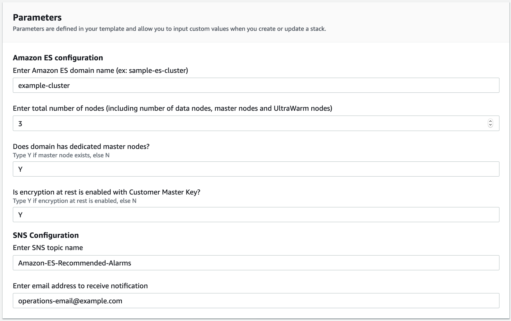

# Amazon ES Recommended Alarms - Automatically create and configure recommended CloudWatch alarms for Amazon Elasticsearch Service

## Introduction

The AmazonESRecommendedAlarm utility enables you to quickly create and manage [CloudWatch metric alarms](https://docs.aws.amazon.com/AmazonCloudWatch/latest/monitoring/AlarmThatSendsEmail.html) for your [Amazon ES](https://aws.amazon.com/elasticsearch-service/) domain. Amazon ES domains send performance metrics to Amazon CloudWatch every minute. You can view the metrics and monitor the performance of your cluster in the [Amazon Elasticsearch Service console](https://docs.aws.amazon.com/elasticsearch-service/latest/developerguide/es-managedomains-cloudwatchmetrics.html). 

Hosting production grade Amazon ES cluster necessitates setting up alerts for critical metrics to send notification to operations team in case of any threshold breach. With Amazon CloudWatch, you can monitor your application workloads, create alarms, set thresholds for alarms.

CloudWatch alarm uses [Amazon Simple Notification Service (SNS)](https://docs.aws.amazon.com/elasticsearch-service/latest/developerguide/es-managedomains-cloudwatchmetrics.html) to send notification in near-real time of any metric exceeds a specified value for some amount of time. For example, you might want AWS to email you if your cluster health status is red for longer than one minute.  Amazon ES recommends critical metrics you must setup alarm to avoid interruption for production cluster. Following are recommended alarm for Amazon ES cluster. For more information, see [Recommended CloudWatch Alarms](https://docs.aws.amazon.com/elasticsearch-service/latest/developerguide/cloudwatch-alarms.html).

|Metric| Alarm|
| :--- | :--- |
| ClusterStatus.red | maximum is >= 1 for 1 minute, 1 consecutive time |
| ClusterStatus.yellow | maximum is >= 1 for 1 minute, 1 consecutive time |
| FreeStorageSpace | minimum is <= 20480 for 1 minute, 1 consecutive time |
| ClusterIndexWritesBlocked | is >= 1 for 5 minutes, 1 consecutive time |
| Nodes | minimum is < x for 1 day, 1 consecutive time |
| AutomatedSnapshotFailure | maximum is >= 1 for 1 minute, 1 consecutive time |
| CPUUtilization | maximum is >= 80% for 15 minutes, 3 consecutive times |
| JVMMemoryPressure | maximum is >= 80% for 5 minutes, 3 consecutive times |
| MasterCPUUtilization | maximum is >= 50% for 15 minutes, 3 consecutive times |
| MasterJVMMemoryPressure | maximum is >= 80% for 15 minutes, 1 consecutive time |
| KMSKeyError | is >= 1 for 1 minute, 1 consecutive time |
| KMSKeyInaccessible | is >= 1 for 1 minute, 1 consecutive time |

Following CloudFormation template lets you setup recommended alarms for your Amazon ES domain.  

## Getting Started
Following screenshot illustrates the parameters required to deploy the template. 
|Parameter|	Description|
| :--- | :--- |
| Amazon ES domain name | 	Enter the domain name (do not enter the endpoint) | 
| Total number of nodes | 	Enter the total No. of nodes in the cluster including data nodes, master nodes and UltraWarm nodes | 
| Dedicated master nodes | 	If domain has dedicated master nodes then enter Y, else N | 
| Encryption at rest | 	If domain has encryption enabled with Customer Master Key then enter Y, else N  | 
| Topic Name |  	Enter the SNS topic name. CloudFormation will add the stack name as suffix of the topic | 
| SNS Email	 | Enter the email address you want to get notification | 


## Walkthrough
1. Sign in to the console and choose the Region of Amazon ES cluster

2. Launch the stack specific to your region

      | Region | CloudFormation |
      |--------|----------------|
      | N. Virginia (us-east-1) |[](https://console.aws.amazon.com/cloudformation/home?region=us-east-1#/stacks/create/review?stackName=Amazon-ES-Recommended-Alarms&templateURL=https://cf-templates-1djmokk063kxm-us-east-1.s3.amazonaws.com/elasticsearch-recommended-alarms.yaml) |
      | Oregon (us-west-2) |[](https://console.aws.amazon.com/cloudformation/home?region=us-west-2#/stacks/create/review?stackName=Amazon-ES-Recommended-Alarms&templateURL=https://cf-templates-1djmokk063kxm-us-west-2.s3-us-west-2.amazonaws.com/elasticsearch-recommended-alarms.yaml) |
      | Frankfurt (eu-central-1) |[](https://console.aws.amazon.com/cloudformation/home?region=eu-central-1#/stacks/create/review?stackName=Amazon-ES-Recommended-Alarms&templateURL=https://cf-templates-1djmokk063kxm-eu-central-1.s3.eu-central-1.amazonaws.com/elasticsearch-recommended-alarms.yaml) |
      | Ireland(eu-west-1) |[](https://console.aws.amazon.com/cloudformation/home?region=eu-west-1#/stacks/create/review?stackName=Amazon-ES-Recommended-Alarms&templateURL=https://cf-templates-1djmokk063kxm-eu-west-1.s3-eu-west-1.amazonaws.com/elasticsearch-recommended-alarms.yaml) |
      | Singapore(ap-southeast-1) |[](https://console.aws.amazon.com/cloudformation/home?region=ap-southeast-1#/stacks/create/review?stackName=Amazon-ES-Recommended-Alarms&templateURL=https://cf-templates-1djmokk063kxm-ap-southeast-1.s3-ap-southeast-1.amazonaws.com/elasticsearch-recommended-alarms.yaml) |

3. Enter your Amazon ES cluster details as shown in the following screenshot. 


4. Choose Create stack
 
5. If your region doesn't list above, clone the repository and use below CLI to deploy the [template] (https://github.com/aws-samples/amazon-es-service-recommended-alarms/blob/main/cloudformation-template/elasticsearch-recommended-alarms.yaml)
    
    

    ```shell
          aws cloudformation create-stack \
            --stack-name Amazon-ES-Recommended-Alarms \
            --template-body file:///elasticsearch-recommended-alarms.yaml \
                  --region <REGION> \
                  --capabilities {CAPABILITY_IAM,CAPABILITY_AUTO_EXPAND} \
                  --parameters '[
                        {"ParameterKey":"NumofNode","ParameterValue":"3"}, 
                        {"ParameterKey":"ExistsMasterNode","ParameterValue":"Y"},
                        {"ParameterKey":"ExistsEncryptionAtRest","ParameterValue":"Y"},
                        {"ParameterKey":"SNSEmail","ParameterValue":"operations-team@example.com"},
                        {"ParameterKey":"TopicName","ParameterValue":"elasticsearch-recommended-alarms"}
                        ]'
    
    ```
6. The CloudFormation stack will create email subscription to the topic. Amazon SNS will send a subscription confirmation message to the email address. [Confirm the subscription](https://docs.aws.amazon.com/sns/latest/dg/SendMessageToHttp.confirm.html) to receive notifications from Amazon SNS

## Cleanup
  Delete Amazon-ES-Recommended-Alarms stack in [CloudFormation](https://docs.aws.amazon.com/AWSCloudFormation/latest/UserGuide/cfn-console-delete-stack.html)

## Security

See [CONTRIBUTING](CONTRIBUTING.md#security-issue-notifications) for more information.

## License

This library is licensed under the MIT-0 License. See the LICENSE file.

